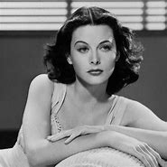
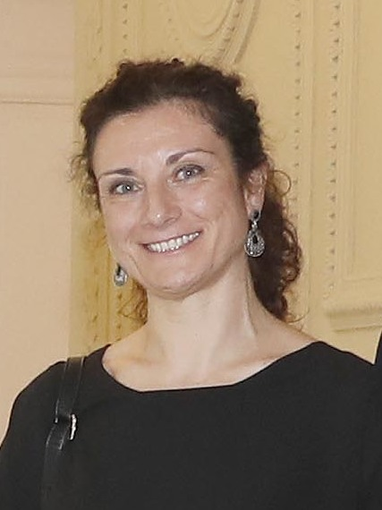

# Tarea contribucion a lamujer
En esta tarea hablaremos sobre mujeres que han echo algo muy importante.
## Hedy Lamarr

Fue la coinventora del WI-FI
- [GEDIT](GEDIT.md)

Radia Joy Perlman

Es la creadora de software e ingeniera de redes

Joan Clarke

Fue la única mujer que trabajo des encriptando las comunicaciones secretas de la Alemania

Grace Murray

Fue la primera programadora que utilizo el mark1 y desarrollo el primer compilador para un lenguaje de marcas

Elena García Armada

Creadora de los exoesqueletos
